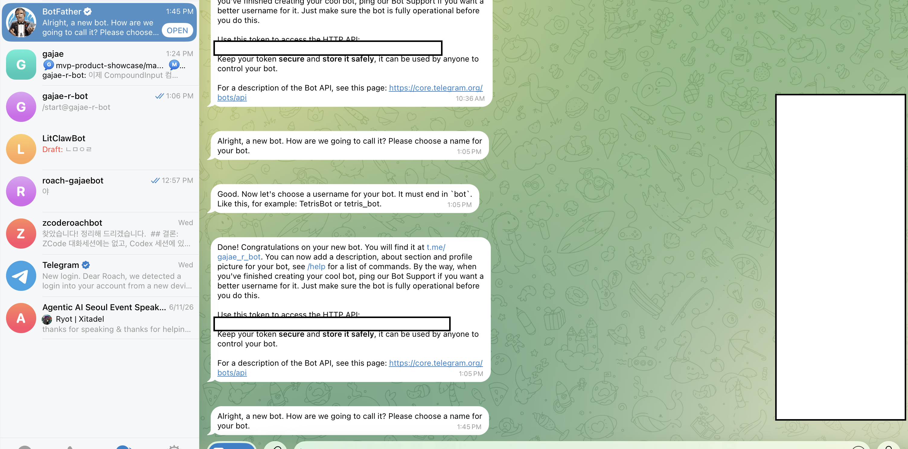
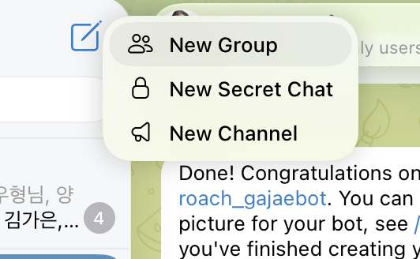
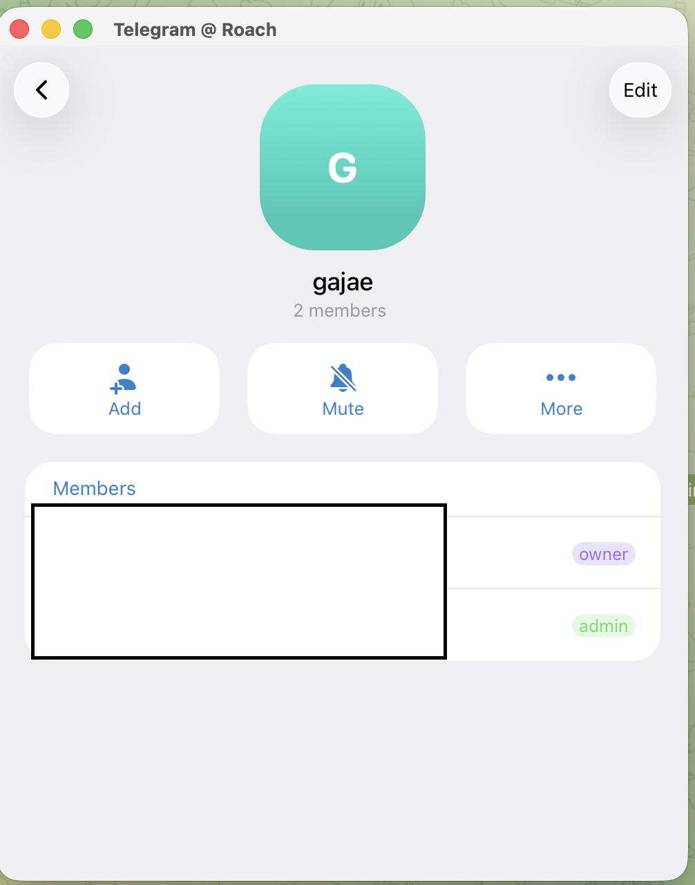

# GJC Telegram 초보자 설치 가이드

이 가이드는 **처음 하는 사람이 화면을 보면서 그대로 따라 하는 절차**다.

이제 사람이 `-100...` 그룹 chat id를 직접 찾지 않아도 된다. `gjc notify setup --group`을 실행한 뒤 Telegram 그룹에서 `/start@봇username`을 보내면 GJC가 그룹 id를 자동으로 잡는다.

## 전체 흐름

```text
1. BotFather에게 봇 token 발급
2. Telegram 그룹 만들기
3. 그룹 Edit 화면에서 Topics 켜기
4. 봇을 그룹에 추가
5. 봇을 관리자로 만들고 Manage Topics 권한 주기
6. 터미널에서 gjc notify setup --group 실행
7. 그룹에 /start@봇username 보내기
8. daemon 재시작
9. GJC 세션 토픽에서 대화
```

중요한 점:

```text
개인 DM chat id는 필요 없다.
브라우저에서 getUpdates를 열어서 -100... 값을 찾을 필요도 없다.
최종 목적지는 Topics가 켜진 Telegram 그룹이다.
```

## 1. BotFather에게 봇 token 발급받기

Telegram에서 한다.

1. Telegram을 연다.
2. `@BotFather`를 검색한다.
3. BotFather 채팅을 연다.
4. 아래 명령을 보낸다.

```text
/newbot
```

5. BotFather가 봇 이름을 물어보면 원하는 이름을 적는다.

예시:

```text
gajae
```

6. BotFather가 봇 username을 물어보면 `bot`으로 끝나는 이름을 적는다.

예시:

```text
gajae-r-bot
```

7. BotFather가 token을 준다.



사진에서 검은색으로 가린 부분이 token이다.

이 token은 비밀번호다. 남에게 보여주면 안 된다.

형태는 보통 이렇게 생겼다.

```text
1234567890:AAExampleExampleExampleExampleExample
```

이 값을 복사해 둔다. 곧 터미널에 붙여넣는다.

## 2. Telegram 그룹 만들기

Telegram에서 새 그룹을 만든다.

1. 왼쪽 위 새 메시지 / 연필 아이콘을 누른다.
2. **New Group**을 누른다.



3. 그룹 이름을 적는다.

예시:

```text
gajae
```

4. 그룹을 만든다.

이 그룹이 GJC 알림을 받을 방이다.

## 3. 그룹 정보 화면에서 Edit 열기

방금 만든 그룹을 연다.

1. 그룹 이름을 누른다.
2. 그룹 정보 화면이 열린다.
3. 오른쪽 위 **Edit**을 누른다.



앞으로 그룹 설정을 바꿀 때는 이 화면에서 **Edit**을 누른다고 생각하면 된다.

## 4. 그룹에서 Topics 켜기

GJC는 세션마다 Telegram 토픽을 만들기 때문에 Topics가 필요하다.

그룹 정보 화면에서:

1. 오른쪽 위 **Edit**을 누른다.
2. **Topics** 또는 **토픽** 항목을 찾는다.
3. 켠다.
4. 저장한다.

Topics가 안 보이면 먼저 이것부터 확인한다.

- 내가 그룹 owner/admin인지 확인한다.
- Telegram 앱을 최신 버전으로 업데이트한다.
- Telegram Desktop에서 다시 시도한다.
- 그래도 안 되면 새 그룹을 만들고 바로 Topics를 켠다.

## 5. 봇을 그룹에 추가하기

그룹 정보 화면에서:

1. **Add** 또는 **Add Members**를 누른다.
2. 1단계에서 만든 봇 username을 검색한다.

예시:

```text
@gajae-r-bot
```

3. 봇을 그룹에 추가한다.

봇이 검색되지 않으면:

1. 봇 개인 채팅을 먼저 연다.
2. **Start**를 누른다.
3. 다시 그룹에서 봇을 검색한다.

그래도 안 되면 브라우저에서 아래 주소를 연다. username은 자기 봇 username으로 바꾼다.

```text
https://t.me/gajae-r-bot?startgroup=true
```

## 6. 봇을 관리자로 만들고 Topics 권한 주기

봇이 그룹에 들어온 것만으로는 부족하다. GJC가 토픽을 만들려면 봇에게 권한이 필요하다.

그룹 정보 화면에서:

1. 오른쪽 위 **Edit**을 누른다.
2. **Administrators / 관리자**를 연다.
3. 봇을 관리자로 추가한다.
4. 아래 권한을 켠다.

```text
Send Messages / 메시지 보내기
Manage Topics / Manage Forum Topics / 토픽 관리
```

5. 저장한다.

`Manage Topics`가 안 보이면 4단계의 Topics 설정이 아직 안 된 것이다.

## 7. GJC가 그룹을 자동으로 찾게 하기

터미널을 연다.

먼저 GJC가 되는지 확인한다.

```sh
gjc --version
gjc --smoke-test
```

이제 아래 명령을 실행한다. `<BOTFATHER_TOKEN>` 부분은 1단계에서 복사한 token으로 바꾼다.

```sh
gjc notify setup --token '<BOTFATHER_TOKEN>' --group
```

터미널에 이런 안내가 나온다.

```text
Token validated. Send /start@gajae-r-bot in the forum-enabled Telegram group to pair notifications.
```

이제 Telegram 그룹으로 돌아가서 아래 메시지를 보낸다. `gajae-r-bot` 부분은 자기 봇 username으로 바꾼다.

```text
/start@gajae-r-bot
```

GJC가 그룹 메시지를 받으면 자동으로 그룹 id를 저장한다.

정상 출력 예시:

```text
Notifications enabled. botToken=1234…(len 46) chatId=-1001234567890
```

여기서 `chatId=-100...`으로 나오면 맞다. 사람이 이 값을 직접 찾거나 복사할 필요는 없다.

## 8. Telegram daemon 재시작하기

설정을 바꿨으니 daemon을 다시 읽힌다.

```sh
gjc daemon reload telegram --force
```

상태를 확인한다.

```sh
gjc notify status
gjc daemon status telegram
```

정상 상태는 이런 식이다.

```text
Notifications
  enabled: true
  botToken: 1234…(len 46)
  chatId: -1001234567890

telegram: running
```

`chatId`가 양수면 개인 DM으로 잡힌 것이다. 7단계를 `--group`으로 다시 실행한다.

## 9. 실제로 GJC 실행하기

이제 GJC를 실행한다.

```sh
gjc
```

또는 tmux로 실행한다.

```sh
gjc --tmux
```

정상이라면 Telegram 그룹 안에 GJC 세션 토픽이 생긴다.

GJC에게 답장할 때는:

1. Telegram 그룹을 연다.
2. GJC가 만든 세션 토픽을 연다.
3. 그 토픽 안에 메시지를 쓴다.

봇 개인 DM이나 그룹의 일반 채팅에 쓰면 세션으로 안 들어갈 수 있다.

## 자주 막히는 곳

### `gjc notify setup --group`이 계속 기다림

대부분 그룹에 `/start@봇username`을 안 보낸 것이다.

Telegram 그룹에 이렇게 보낸다.

```text
/start@gajae-r-bot
```

### `Rejected group chat`이 나옴

Topics가 안 켜진 일반 그룹이라는 뜻이다.

그룹 Edit 화면에서 Topics를 켠 뒤 다시 한다.

### `Manage Topics` 권한이 안 보임

Topics가 아직 안 켜진 것이다. 4단계를 다시 확인한다.

### token을 실수로 공개함

BotFather에서 token을 재발급한다.

1. BotFather에 `/mybots` 입력
2. 봇 선택
3. **API Token** 선택
4. Revoke/regenerate
5. 새 token으로 7단계 다시 실행

## 마지막 체크리스트

아래가 다 맞으면 끝이다.

```text
[ ] BotFather에서 token 발급받음
[ ] Telegram 그룹 만들었음
[ ] 그룹 Edit 화면에서 Topics 켰음
[ ] 봇을 그룹에 추가했음
[ ] 봇을 관리자로 만들었음
[ ] 봇에게 Manage Topics / 토픽 관리 권한 줬음
[ ] gjc notify setup --token ... --group 실행했음
[ ] 그룹에서 /start@봇username 보냈음
[ ] gjc notify status에서 chatId가 -100...으로 보임
[ ] gjc daemon status telegram이 running임
[ ] Telegram 그룹에 GJC 세션 토픽이 생김
```
